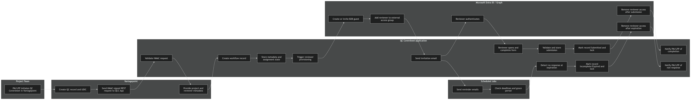
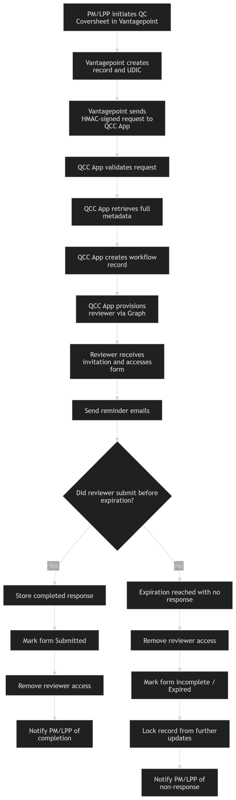

# QC Coversheet Workflow – Order of Operations

## Purpose

Describes how the **QC Coversheet (QCC) Application** manages external subconsultant review requests initiated from **Vantagepoint**, including:

- workflow initiation
- reviewer provisioning
- secure access
- review submission
- automated reminders
- access removal
- incomplete/expired record handling

This version includes both:

- the **standard completion scenario**
- the **non-response / expiration scenario**

# 1\. Systems and Actors

## Human Actors

- **Project Manager (PM) / Lead Project Professional (LPP)**
- **External Subconsultant Reviewer**
- **QCC Application Administrator**

## Systems

- **Vantagepoint**
- **QC Coversheet Application (Docker Container)**
- **Microsoft Entra ID**
- **Microsoft Graph**
- **Service Mailbox / Email Automation**
- **PostgreSQL**
- **Cron / Scheduled Background Jobs**
- **NGINX / Azure VM hosting environment**

# 2\. High-Level Workflow Phases

1.  **Initiate review request**
2.  **Validate and ingest request**
3.  **Create internal workflow record**
4.  **Provision external reviewer access**
5.  **Send invitation and reminders**
6.  **Reviewer responds or fails to respond**
7.  **Close workflow**
8.  **Remove access and lock record**

# 3\. Detailed Order of Operations

## Phase 1 — Workflow Initiation in Vantagepoint

### Step 1

**Actor:** PM / LPP  
**System:** Vantagepoint

- PM or LPP initiates the QC Coversheet process in Vantagepoint.
- Vantagepoint creates the QC Coversheet-related record.
- A **UDIC ID** and associated review metadata are generated.

### Step 2

**Actor:** Vantagepoint  
**System:** QC Coversheet Application

- Vantagepoint sends a REST request to the QCC Application ingest endpoint.
- The ingest request contains:
  - UDIC ID
  - event metadata
  - correlation/reference data

### Security Controls

- Request is signed using **HMAC**
- Request includes:
  - `X-Timestamp`
  - `X-Signature`

- Shared secret is stored in **Secret Server**
- Endpoint is the only intended unauthenticated public workflow entry point

## Phase 2 — Ingest Validation and Data Retrieval

### Step 3

**Actor:** QC Coversheet Application

- Application validates:
  - HMAC signature
  - request format
  - required headers

- If validation fails:
  - request is rejected
  - workflow is not created
  - failure is logged

### Step 4

**Actor:** QC Coversheet Application  
**System:** Vantagepoint

- Once ingest is accepted, the application calls the Vantagepoint stored procedure / API process to retrieve full record details.
- Retrieved data includes:
  - project metadata
  - PM and LPP information
  - reviewer contact information
  - submittal information
  - response deadline / grace-period basis

### Step 5

**Actor:** QC Coversheet Application  
**System:** PostgreSQL

- Application creates internal workflow records.
- Application stores:
  - reviewer metadata
  - project identifiers
  - assignment state
  - access lifecycle dates
  - workflow status

### Initial Status

Example status at this stage:

- `Pending Invitation`
- then `Active`

## Phase 3 — External Reviewer Provisioning

### Step 6

**Actor:** QC Coversheet Application  
**System:** Microsoft Graph / Entra ID

Application automates reviewer provisioning by:

- creating or inviting the reviewer as an **Entra B2B Guest**
- adding reviewer to the designated external reviewer security group
- associating reviewer access with the application’s Reviewer role model

Example group:

- `QC-Coversheet-Ext-Editor`

### Security Controls

- Graph permissions limited to approved automation scope
- Access is temporary and workflow-driven
- External access is tied to application need, not indefinite standing access

## Phase 4 — Notification and Access Window Opens

### Step 7

**Actor:** QC Coversheet Application  
**System:** Email Automation

- The application sends an invitation / notification email to the reviewer.
- Email includes:
  - review purpose
  - link to application
  - expected completion timeline
  - access instructions

### Step 8

**Actor:** Reviewer  
**System:** Entra ID + QC Coversheet Application

- Reviewer accepts B2B invitation.
- Reviewer authenticates with Microsoft Entra ID.
- Reviewer is granted access based on:
  - successful authentication
  - active guest identity
  - required group membership
  - application-level authorization checks

## Phase 5A — Standard Response Path

### Step 9A

**Actor:** Reviewer  
**System:** QC Coversheet Application

- Reviewer opens the QC Coversheet form.
- Reviewer completes required responses:
  - radio button selections
  - optional text notes

### Step 10A

**Actor:** QC Coversheet Application

- Application validates form content.
- Application stores submitted response.
- Record status changes to:
  - `Submitted`
  - or equivalent completed state

### Step 11A

**Actor:** QC Coversheet Application / Scheduled Automation  
**System:** Microsoft Graph

- Reviewer is removed from the external reviewer security group.
- External application access is revoked.

### Step 12A

**Actor:** QC Coversheet Application  
**System:** Email Automation

- Completion notification is sent to:
  - PM
  - LPP / designated internal stakeholders

### Final State – Standard Path

- Form is completed
- Record is closed
- Reviewer access is removed
- No further updates permitted

## Phase 5B — Non-Response / Expiration Path

### Step 9B

**Actor:** Scheduled Background Job  
**System:** Cron / QC Coversheet Application

- Scheduled jobs periodically evaluate all active review requests.
- Application checks:
  - submission due date
  - grace period
  - current response status
  - reviewer access state

### Step 10B

**Actor:** Scheduled Background Job  
**Condition:** Reviewer has **not submitted** by expiration threshold

If no response has been submitted by the defined expiration point:

- workflow status is updated to:
  - `Expired`
  - `Incomplete`
  - and/or `Locked`

### Step 11B

**Actor:** QC Coversheet Application / Microsoft Graph

- Reviewer is automatically removed from the external reviewer security group.
- Any active reviewer application access is revoked.

### Step 12B

**Actor:** QC Coversheet Application / PostgreSQL

- The form record is marked as:
  - incomplete
  - closed to updates
  - locked from further reviewer changes

This ensures:

- reviewer cannot submit late without deliberate administrative intervention
- expired access does not remain active
- record state accurately reflects non-completion

### Step 13B

**Actor:** QC Coversheet Application  
**System:** Email Automation

- Notification is sent to the PM and/or LPP indicating:
  - reviewer did not respond
  - access was automatically removed
  - record has been closed as incomplete / expired

### Final State – Non-Response Path

- No reviewer submission received
- Reviewer access removed automatically
- Form remains incomplete
- Form is locked
- Internal stakeholders are notified

# 4\. Business and Security Rules

## Access Rules

- External reviewers receive **temporary access only**
- Access is granted only for the duration of an active review window
- Access is removed on:
  - successful submission
  - expiration / non-response
  - administrative intervention if needed

## Record Locking Rules

- Submitted forms are locked from additional changes
- Expired incomplete forms are also locked from reviewer updates
- Reopening should require explicit administrative action, if supported at all

## Security Rules

- Authentication uses **Microsoft Entra ID**
- External users are managed as **B2B Guest users**
- REST ingest is protected by **HMAC**
- Graph actions are performed with approved application permissions
- Notification email uses a dedicated service mailbox
- Secrets are managed via **Secret Server**

# 5\. Application Diagram – Swimlane

# 6\. Application Diagram – Decision Flow

